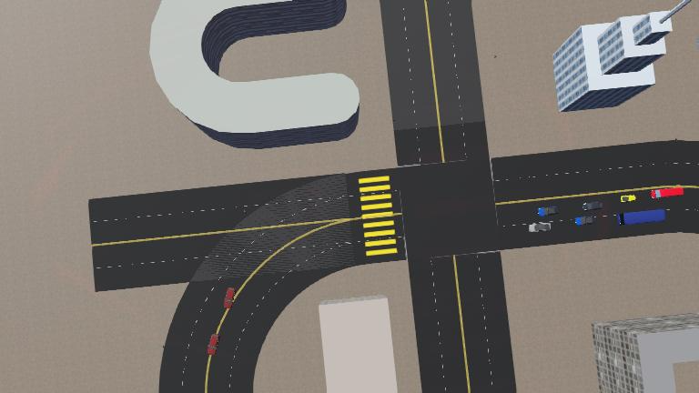

# 🚗 ACVSS Autonomous Vehicle Simulation TL;DR



* ✅ **Install Webots** from [https://cyberbotics.com](https://cyberbotics.com)
* ▶️ **Run the world**:
  Open `worlds/city_traffic.wbt` in Webots and press **Play**

---

Python controllers are in:

```
controllers/
├── autonomous_vehicle_py_simple/
```


# 🚗 Autonomous Vehicles Simulation - ACVSS

This project is a collection of Webots simulation controllers focused on autonomous vehicle behaviors using Python. It includes modules for autonomous driving, camera-based perception, LiDAR activation, robot control, and more.

## 🧭 Folder Structure (Python Controllers Only)

```
controllers/
├── autonomous_vehicle_py/
│   └── autonomous_vehicle_py.py
├── autonomous_vehicle_py_simple/
│   └── autonomous_vehicle_py_simple.py
├── camera/
│   ├── camera.py
│   ├── camera_real.py
│   ├── real_traffic.mp4
│   ├── yolov8n.pt
│   ├── images/
│   │   └── image_1.png ... image_10.png
│   └── output/
│       └── objects_log.json
├── drive_robot/
│   └── drive_robot.py
├── enable_all_lidars/
│   └── enable_all_lidars.py
├── highway_overtake/
│   └── highway_overtake.py
├── vehicle_driver/
│   └── vehicle_driver.py
```

Each controller represents a unique experiment or functionality related to autonomous vehicle behavior.

---

## 🧰 Requirements

* [Webots](https://cyberbotics.com/) (open-source robot simulator)
* Python 3.7+
* `ultralytics`, `opencv-python`, and other optional dependencies for perception modules.

Install Webots first, then set up Python dependencies:

```bash
pip install ultralytics opencv-python
```

---

## ⚙️ Installation Guide for Webots

1. Download and install Webots from [https://cyberbotics.com](https://cyberbotics.com).
2. Clone this repository or copy the project folder:

   ```bash
   git clone <your_repo_link>
   cd vehicles
   ```
3. Open Webots.
4. From Webots, open the world by navigating to:

   ```
   File → Open World → [project_root]/worlds/city_traffic.wbt
   ```
5. Press the **Play** button (green triangle ▶️) to run the simulation.

---

## 🧠 Modules Overview

* `autonomous_vehicle_py`: Core autonomous driving logic.
* `camera/`: Object detection using YOLOv8 and image logging.
* `enable_all_lidars`: Enables all LiDAR sensors on the vehicle.
* `drive_robot`: Basic manual robot movement.
* `highway_overtake`: Simulates overtaking on a multi-lane road.
* `vehicle_driver`: General-purpose vehicle driver.

---

## 📦 Resources

* `resources/osm_files/`: OSM files for different environments.
* `worlds/`: Contains simulation environments. Start from `city_traffic.wbt` or `simple.wbt`.

---

## 📝 Notes

* To run any controller, assign it to the robot inside Webots via the robot's **Controller** field.
* The `camera_real.py` uses `real_traffic.mp4` and YOLOv8 for real-world testing.
* The `objects_log.json` is generated after inference and contains detected objects and their positions.

---

## 🤖 Credits

Created as part of the [ACVSS](http://acvss.ai/) hackathon  